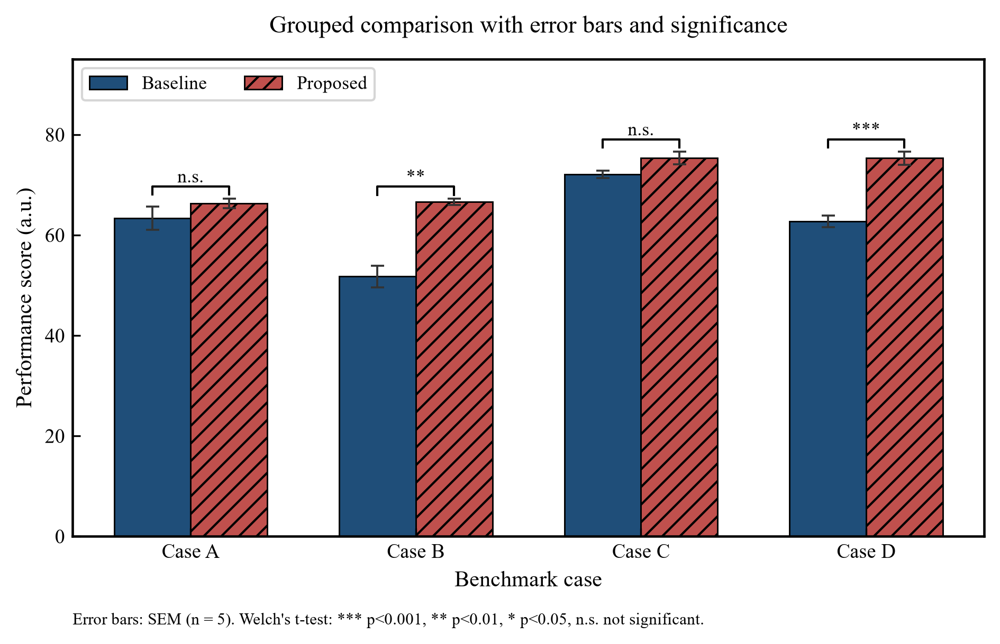
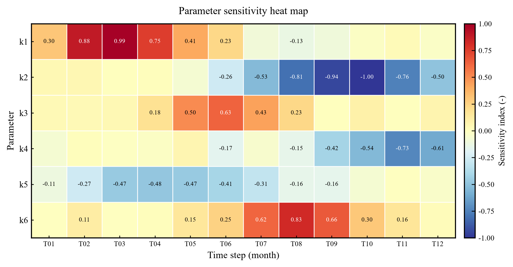

# Euler-Modelforge

> **A workflow engine for mathematical-modeling contests (MCM/ICM · CUMCM)** — from problem statement to submittable paper, with **35 solver templates (smoke-covered)** and the **MCM LaTeX paper template bundled** (CUMCM template: bring your own).
> **Every step has a gate; every claim leaves evidence.** Missing pieces are marked `[降级]`/`SKIP` and always reported — never silently passed.
> Chinese version: [`README.md`](README.md) (Chinese is the source of truth; the English mirror follows within 7 days — see `CONTRIBUTING.md`).
> **CI**: `.github/workflows/ci.yml` runs the self-checks and smoke chains on every push/PR (Python 3.11 + 3.13) — [](https://github.com/WannaC77/Euler-Modelforge/actions/workflows/ci.yml).
> **Repository / Releases**: <https://github.com/WannaC77/Euler-Modelforge> · <https://github.com/WannaC77/Euler-Modelforge/releases>

`Euler-Modelforge` is not a "one-click paper generator". It is a **reproducible, time-boxed process**: every step has an executable gate, every claim maps back to evidence, and every missing component degrades honestly with a `[降级]` (degraded) marker instead of pretending to work.

**This product does not depend on** any specific agent, CLI, scheduler, or API key — anyone (or any agent) who can read files and run Python 3.11+ can use it.

---

## Who it is for

| Audience | Why |
|---|---|
| MCM/ICM & CUMCM teams | A disciplined pipeline under a hard clock |
| Contest coaches / instructors | An engineering-style way to teach modeling → solving → writing |
| Anyone who wants *auditable* AI-assisted work | Gates, evidence chains, and honest degradation instead of blind generation |

**Not for**: generating a submittable paper for you, fabricating or polishing data, or evading academic-integrity review.

## Quick start (three-step loading)

```
1. Read BOOT.md → Euler-CORE.md → Euler-ENGINE.md
2. Pick a runbook and load workflows/NN-*.md + workflows/_SHARED.md
3. Call tools/ or scripts/ when you need computation or gates; mark missing pieces as [降级]
```

Then:

```bash
python -m venv .venv          # <venv> below = the venv dir you just created
<venv>/Scripts/python -m pip install -r templates-library/requirements.txt   # Windows
<venv>/bin/python     -m pip install -r templates-library/requirements.txt   # Linux/macOS

python tools/env_check.py --selftest          # environment self-check + degradation probe
python tools/smoke_chain.py --selftest        # end-to-end smoke chain (with numeric assertions)
python templates-library/smoke_all.py --quick # 35 solver templates
```

See [`QUICKSTART.md`](QUICKSTART.md) for the 5-minute path and [`AGENTS.md`](AGENTS.md) if you are a code agent.

## What you get in 5 minutes

Everything below comes from **actually running this repo** (synthetic data, fixed seeds) — no mock-ups:

| Artifact | What it is | How to get it |
|---|---|---|
|  | grouped-bar sample from `templates-library/utils/figkit/` | what `python tools/smoke_chain.py --selftest` produces (step 3 of `QUICKSTART.md` — the M6 stage runs this very script) |
|  | heat-map sample from figkit (demo2) | the figure-type reference for M6 sensitivity on the same chain |
|  | the smoke chain's **text output** (verdict: `FAIL=0 → PASS`) | what that command looks like in your terminal — this is how you tell the install worked |

Then start from step 0 of [`QUICKSTART.md`](QUICKSTART.md).

## Capability map

| # | Module | What it does | Gate highlights |
|---|---|---|---|
| E-M1 | Problem locator | decomposition card / topic matrix | complete fields; problem type, model family, data availability |
| E-M2 | Assumptions & symbols | assumption table / symbol table | three-part statements; symbols consistent across code and paper |
| E-M3 | Model selection | model cards | exhaustive candidate list (adopt / exclude / degrade); fusion requires comparison |
| E-M4 | Solver workshop | solve + reproduce | template smoke `rc=0`; fixed seed; four improvement items |
| E-M5 | Validation bench | sensitivity + cross-checks | scan report; ≥1 cross-check; dimensional analysis; ≥2 tests |
| E-M6 | Figure workshop | publication-grade figures | three gates (overflow / file layer / visual); grayscale & color-blind friendly |
| E-M7 | Paper assembly line | paper | abstract five elements; four review rounds + claim-evidence map; compile or `[降级]` |
| E-M8 | Submission gate | submission package | precheck C1/B1; checksums; AI-usage reminder |
| E-M9 | Calibration & anchors (L2) | your private calibration | declaration only; **never run during the contest** |
| E-M10 | Orchestrator | runbook + hand-off card | one hand-off per deliverable |
| E-R | Base | environment / smoke | `env_check`; `smoke_all` 35/35; `smoke_chain`; `--selftest` |

## Repository layout

```
Euler-Modelforge/
├── BOOT.md                 # ≤2 KB cold-start file
├── README.md / README.en.md
├── AGENTS.md               # generic loading protocol for code agents
├── QUICKSTART.md · CHANGELOG.md · CITATION.cff
├── LICENSE (MIT) · LICENSE-DOCS (CC BY 4.0) · THIRD-PARTY.md
├── Euler-CORE.md · Euler-ENGINE.md
├── learnings.md            # blank template + distillation mechanism
├── modules/                # E-M1 … E-M10 + base (each with a degradation column)
├── workflows/              # 00–10 + _SHARED.md + W-ABSORB.md
├── templates/              # decomposition card, model card, assumption table, reproduction card, …
├── references/             # scoring rubric, figure pipeline, paper SOP, troubleshooting card, …
├── tools/                  # env_check.py · smoke_chain.py
├── scripts/                # precheck_paper.py · verify_manifest.py
├── templates-library/      # 35 solver templates + utils + smoke_all.py
├── paper-templates/        # MCM (mcmthesis, bundled) + CUMCM (bring your own; see its README)
├── kb/                     # your own knowledge base (empty; see kb/README.md)
├── docs/images/            # samples produced by real runs (see "What you get in 5 minutes")
├── SUPPORT.md · MAINTAINERS.md · .pre-commit-config.yaml / .editorconfig / .gitattributes
└── .github/                 # CI (workflows/ci.yml) · issue & PR templates · CODEOWNERS · dependabot
```

## Requirements & degradation

- **Python 3.11+**; `templates-library/requirements.txt` for the solver templates.
- **LaTeX optional**: with XeLaTeX you get compiled PDFs; without it, papers degrade to `.tex` + compile instructions (`[降级]`).
- **CJK fonts optional**: if absent, captions fall back to English and the report says so.

## Layer model (L0 / L1 / L2)

| Layer | Content | Shipped? |
|---|---|---|
| **L0** | ENGINE, modules, workflows, templates, tools, `templates-library`, `paper-templates` | ✅ fully open |
| **L1** | contest profiles / track parameters | generic examples only |
| **L2** | your private calibration ledger, anchor cards, shared collaboration layer | ❌ not shipped — build your own (`kb/`, `<校准台账>`, `<锚注册卡>/`) |

## Related project (sibling)

**[Vesi-Labflow](https://github.com/WannaC77/Vesi-Labflow)** is the sibling project: the same "single-core multi-track + loading discipline + falsifiable gates" architecture realized for the **life-science / formulation-PK** domain. Same architecture, different domain — each stands alone.

## Integrity & licensing

- AI is an **assistant**: core modeling and conclusions must be yours — see `workflows/10-AI使用声明.md`.
- Code: **MIT** (`LICENSE`). Documentation: **CC BY 4.0** (`LICENSE-DOCS`). Third-party assets: see `THIRD-PARTY.md`.
- No contest-official materials, third-party papers, or real participant data are included.

## Maintenance

- Maintainers / support: `MAINTAINERS.md` · `SUPPORT.md` (run the self-checks first; first response ≤ 7 days).
- Versioning & rollback: `CHANGELOG.md` (SemVer tag convention; tag entries double as release notes).
- Before opening a PR: `pip install pre-commit && pre-commit run --all-files`.
- Docs-vs-disk consistency: `python scripts/verify_manifest.py --root .` (a missing referenced file → `rc=1`; usage error → `rc=2`).
